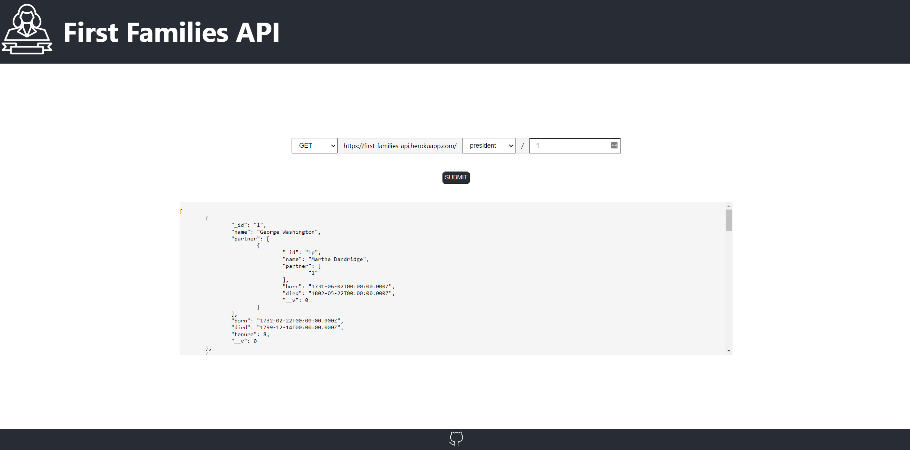

# First Families

## Overview

I created an interactable front-end for my First Families API using ReactJS and standard CSS to style the page. I wanted to create an easy way for people to query the database and make contributions.

I deployed my project on to my GitHub pages site at https://iandemed.github.io/first-families/

## First Families API

I created the First Families API to hold basic biographical information on each of the presidents and their descendants.

In that regard, unless they are related to another president (i.e. George W. Bush, John Quincy Adams, and Benjamin Harrison), presidents are considered the first generation.

Often we celebrate (or denouce) presidents for their political accomplishments and ignore the fact that they are also human-beings with families, that their legacy is more than just their policy agendas, and that their influence and power may also benefit their direct descendants.

## Table of Contents

- [First Families](#first-families-api)
  - [Overview](#overview)
  - [First Families API](first-families-api)
  - [Techincal Requirements](#techincal-requirements)
    - [Technologies Used](#technologies-used)
    - [Dependencies](#dependencies)
    - [Authentication](#authentication)
  - [Additional Notes](#additional-notes)

## Techincal Requirements

### Technologies Used

1. ReactJS
2. CSS - to style the web-page

### Dependencies

I used 5 packages to construct my project:

1. `npm` - to install and manage the other packages used in my project
2. `express` - to allow HTTP connection and routing for my API
3. `mongoose` - to interact with the database
4. `axios` - to make the make the HTTP requests

Installation instructions for npm and Node.js can be found [here](https://www.npmjs.com/get-npm).

Once `npm` is installed successfully on your machine, you can install the dependencies by navigating to your local directory for this repo and run `npm install`.

All of the required dependencies can be found in `package.json` file.

### Authentication

As of the most current release of this API, there is no documentation. The First Families API is a completely open API

## Additional Notes
